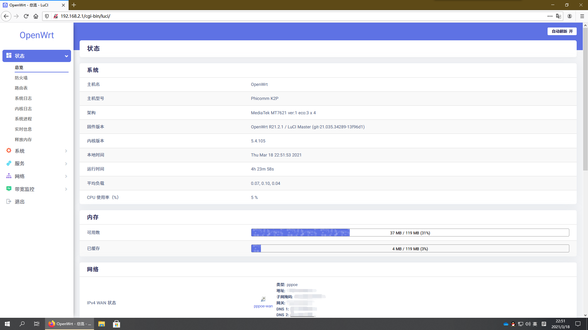
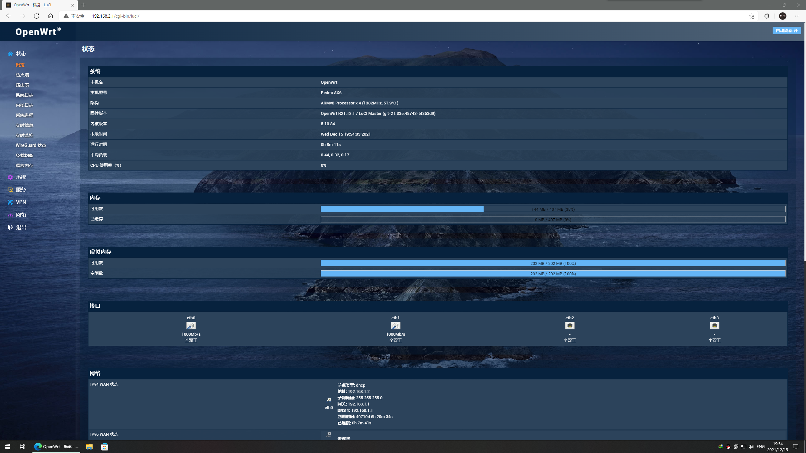

简体中文 | [English](./README.md)

# 关于这个仓库

> 这个仓库基于[P3TERX/Actions-OpenWrt](https://github.com/P3TERX/Actions-OpenWrt)<br>
> LEDE分支来自[coolsnowwolf/lede](https://github.com/coolsnowwolf/lede)<br>
> OpenWRT分支来自[robimarko/openwrt](https://github.com/robimarko/openwrt/tree/ipq807x-5.15)<br>

用Github Actions为K2P和AX6自动编译固件

## 一些心里话

还是说下吧，其实我开这个库就是为了我自己持有的斐讯K2P和换代的红米AX6，k2p是19年年初因为实在不堪老TP的信号差买来给家里用的，当时是用的rt-n56u的固件，然后直到20年年中工作了，第一个月买了水星D191G，表面说是孝敬家人，其实是去把K2P拿出来刷机了，于是用了一年多，最后实在是因为不堪mt7621科学上网的性能和16M存储放不开手脚买了红米AX6(没想到买来没几个月停产涨价了😂)，于是K2P就吃灰了，主要是128M的存储相对K2P是终于富余了一些，然而膏通属实不给力...开源驱动有内存泄漏问题，也不知道现在解决了没有，这个问题除非用基于OpenWRT改用闭源无线驱动的QSDK才能好(所以我屯了一些QSDK的固件)，于是我就QSDK养老了，至于K2P，因为吃灰我顶多就是哪天心情好更新上游就差不多了，就这样吧

## 特性

* PassWall(K2P Only)
* OpenClash(AX6 Only，因为K2P那16M存储塞不下)
* Turbo ACC
* 广告过滤
* 网易云解锁
* 网络唤醒
* ZeroTier
* DDNS
* 更多功能自行刷入查看(可能会不定期变动)...

## 针对AX6的说明

1. 上传自己的`AX6-LEDE.config`文件
2. 进入Actions页面手动启动编译
3. 当编译完成后，在Releases页面下载含编译出的`xxx-factory.ubi`固件(如果要在op下升级则是下载`xxx-sysupgrade.bin`后缀的固件)
4. 如果你此前给AX6刷入了双系统，请输入`fw_setenv flag_last_success=1`和`fw_setenv flag_boot_rootfs=1`然后重启设备切换系统（没有的话请点击[参考链接](https://www.right.com.cn/forum/thread-6054985-1-1.html) [GitHub镜像](.gitbook/assets/ax6-dualsystm.md)安装双系统）
5. 通过scp上传后缀为.ubi的固件
6. 刷入固件`ubiformat /dev/mtd13 -y -f /tmp/openwrt-xxx-redmi_ax6-squashfs-nand-factory.ubi`PS：文件名只是个例子，刷入时以你下载的ubi文件名为准
7. 输入`fw_setenv flag_last_success=0`和`fw_setenv flag_boot_rootfs=0`然后重启设备，完成

## 针对K2P的说明

1. 上传自己的`K2P.config`文件
2. 进入Actions页面手动启动编译
3. 当编译完成后，在Releases页面下载含编译出的`xxx-sysupgrade.bin`固件
4. 进入breed，选择⚠️斐讯布局⚠️刷入压缩包中含sysupgrade字样的文件

## 后台进入方式和密码

   | 项目 | 值 |
   | :--- | :--- |
   | 默认后台地址 | `192.168.2.1` |
   | 默认后台密码 | `password` |

## 教程以及额外说明 <a id="tutorial"></a>

* [如何更新固件](tutorial/ru-he-geng-xin-gu-jian.md)

## 截图

K2P：

AX6：



## 已知问题
#### 免责声明：以下已知问题均为个人实测，可能还有未知问题，本人不对因固件导致的任何问题承担担任何责任
AX6：
* 截止到本文编辑完毕，由于ax6的内存泄露问题依然没解决，所以我的个人建议是每隔一段时间重启，通过系统——启动项——本地启动脚本补充以下命令（注意：要在exit 0之前）：
   ```bash
   echo "0 4 * * * sleep 5 && touch /etc/banner && reboot" >> /etc/crontabs/root
   echo "0 16 * * * sleep 5 && touch /etc/banner && reboot" >> /etc/crontabs/root
   ```
   然后重启一次路由器 这样就会在每天凌晨4点和下午16点重启，如果能看懂crontab的原理的话也可以自定义重启时间
   
* (更新)重启问题有缓解，但是会有偶现断流问题

K2P：
* (LEDE分支)Redmi K30 Ultra等MTK天玑1000+设备(不知道其它天玑设备有没有被波及)可能只有433Mbps(至少本人手机是这样)，目前尚未查明原因，如果知道原因，欢迎提issue。


## 感谢

* [Microsoft Azure](https://azure.microsoft.com/)
* [GitHub Actions](https://github.com/features/actions)
* [OpenWRT](https://github.com/openwrt/openwrt)
* [tmate](https://github.com/tmate-io/tmate)
* [Boos4721](https://github.com/Boos4721)
* [Lean's OpenWrt](https://github.com/coolsnowwolf)
* [P3TERX](https://github.com/P3TERX)
* [smith97](https://www.right.com.cn/forum/thread-6054985-1-1.html)
* 以及所有跟OpenWRT/LEDE相关的贡献者
