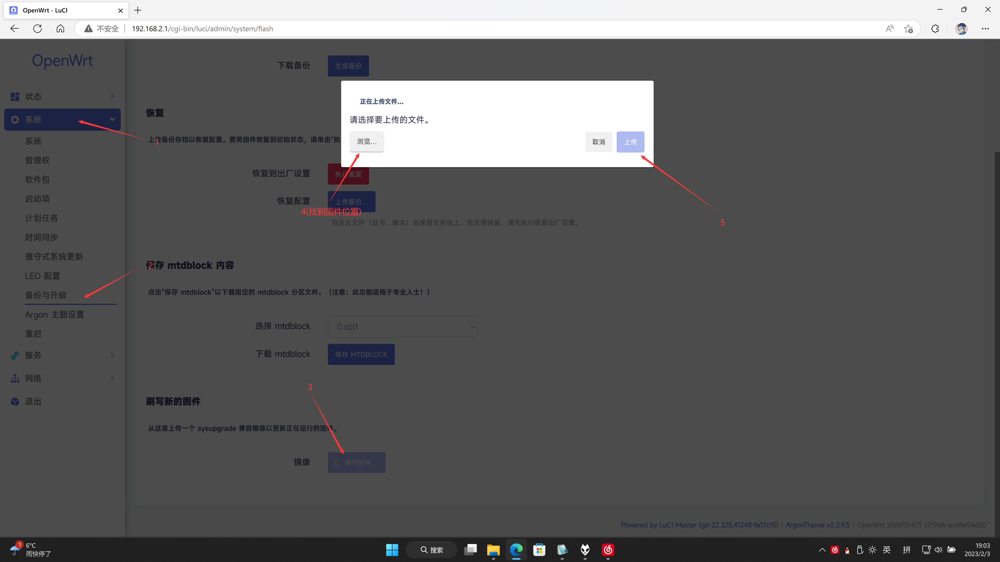
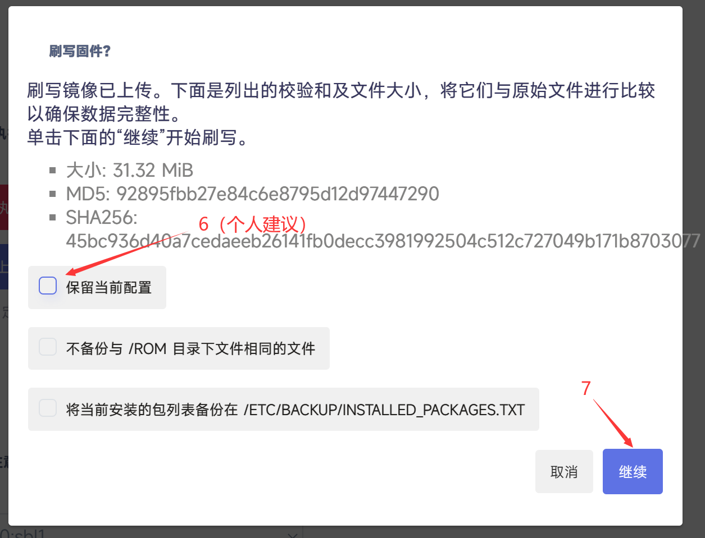
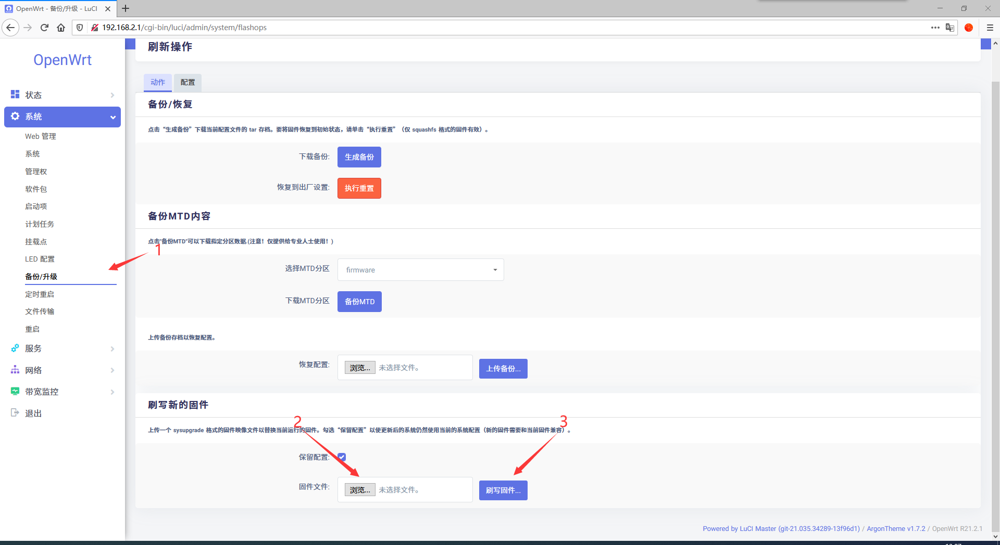

# 如何更新固件

## 图解

### 如果是用openwrt源码的

### 如果是用旧openwrt和LEDE源码的

## 注意事项

1. 如果更新中没有你特别想要的功能（比如常规更新，只是安全性与稳定性之类的小升级），不建议更新，⚠️因为更新后你通过软件源安装的软件将会丢失⚠️。
2. 如果你想从软件源安装新的软件，请务必升级至最新版本。
3. 可能需要多次升级固件才能完成升级，若想知道是否完成升级可下载并打开version.buildinfo，然后跟固件版本的rXXXXX-...进行对照，版本号一致即完成升级。
4. 如果你是打算从同一作者编译的同一分支固件（比如你之前用的本项目固件，想升级的）进行升级的可勾选保留当前配置，以省去配置的麻烦。
5. 如果遇到上游内核升级的情况(比如5.15.y升级到6.1.y)则必须清除数据升级，否则直接保留数据升级可能会造成使用异常，如果升级后有异常情况请尝试恢复出厂设置。  
